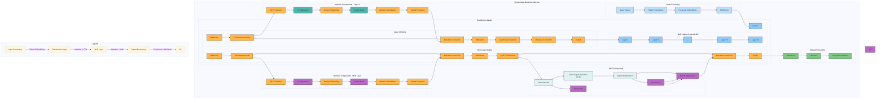

```mermaid
%%{init: {
  "theme": "base",
  "themeVariables": {
    "background": "#FFFFFF"
  }
}}%%
graph TD
    %% Main Model Architecture
    subgraph "Hy3-preview Model Architecture"
        
        %% Input Section
        subgraph "Input Processing"
            A[Input Tokens] --> B[Token Embeddings]
            B --> C[Positional Embeddings]
            C --> D[RMSNorm]
        end

        %% Transformer Layers
        subgraph "Transformer Layers"
            D --> E[Layer 1]
            
            subgraph "Layer 1 Details"
                E1[RMSNorm] --> E2[Self Attention Normal]
                E2 --> E3[Residual Connection]
                E3 --> E4[RMSNorm]
                E4 --> E5[Feedforward Network]
                E5 --> E6[Residual Connection]
                E6 --> E7[Output]
            end
            
            E7 --> F[Layer 2]
            
            subgraph "MoE Layers (Layers 2-80)"
                F --> G[Layer 3]
                G --> H[...]
                H --> I[Layer 79]
                I --> J[Layer 80]
            end
            
            subgraph "MoE Layer Details"
                J1[RMSNorm] --> J2[Self Attention MoE]
                J2 --> J3[Residual Connection]
                J3 --> J4[RMSNorm]
                J4 --> J5[MoE Feedforward]
                J5 --> J6[Residual Connection]
                J6 --> J7[Output]
            end
        end

        %% Output Section
        subgraph "Output Processing"
            J7 --> K[RMSNorm]
            K --> L[LM Head]
            L --> M[Output Probabilities]
        end

        %% Attention Components - Layer 1
        subgraph "Attention Components - Layer 1"
            E2 --> E8[QKV Projection]
            E8 --> E13[KV Replication]
            E13 --> E9[Rotary Embedding]
            E9 --> E14[Causal Mask]
            E14 --> E10[Attention Calculation]
            E10 --> E11[Output Projection]
            E11 --> E3
        end
        
        subgraph "Attention Components - MoE Layer"
            J2 --> J8[QKV Projection]
            J8 --> J13[KV Replication]
            J13 --> J9[Rotary Embedding]
            J9 --> J14[Causal Mask]
            J14 --> J10[Attention Calculation]
            J10 --> J11[Output Projection]
            J11 --> J3
        end

        %% MoE Components
        subgraph "MoE Components"
            J5 --> J20[Gate Network]
            J20 --> J21["Top-K Expert Selection (K=8)"]
            J21 --> J22[Expert Computation]
            J22 --> J15[Expert Aggregation]
            J15 --> J6
            
            J20 --> J16[Expert Bias]
            J22 --> J17[Shared MLP]
            J17 --> J15
        end

        %% Styling
        classDef modelLayer fill:#e1f5fe,stroke:#000,stroke-width:1px;
        classDef attentionLayer fill:#e8f5e9,stroke:#000,stroke-width:1px;
        classDef moeLayer fill:#f3e5f5,stroke:#000,stroke-width:1px;
        classDef normLayer fill:#f1f8e9,stroke:#000,stroke-width:1px;
        classDef component fill:#fff3e0,stroke:#000,stroke-width:1px;
        classDef special fill:#ffebee,stroke:#000,stroke-width:1px;
        classDef gqaLayer fill:#e0f2f1,stroke:#000,stroke-width:1px;

        class A,B,C,D,K,L,M modelLayer;
        class E1,E2,E3,E4,E5,E6,E7,E8,E9,E10,E11,E13,E14,J1,J2,J3,J4,J5,J6,J7,J8,J9,J10,J11,J12,J13,J14,J15,J16,J17,J20,J21,J22 normLayer;
        class E2,E8,E9,E10,E11,E13,E14,J2,J8,J9,J10,J11,J13,J14,J20,J21,J22 attentionLayer;
        class J5,J12,J13,J14,J15,J16,J17,J20,J21,J22 moeLayer;
        class J12,J13,J14,J15,J16,J17,J20,J21,J22 special;
        class E13,E14,J13,J14,J20,J21,J22 gqaLayer;
    end

    %% Key Connections
    J17 --> J15

    %% Legend
    subgraph "Legend"
        L1[Input Processing] -->|Token Embeddings| L2
        L2[Transformer Layer] -->|Attention + FFN| L3
        L3[MoE Layer] -->|Attention + MoE| L4
        L4[Output Processing] -->|Final Norm + LM Head| L5
    end

    %% Model Parameters
    style A fill:#bbdefb,stroke:#000
    style B fill:#bbdefb,stroke:#000
    style C fill:#bbdefb,stroke:#000
    style D fill:#bbdefb,stroke:#000
    style E fill:#90caf9,stroke:#000
    style F fill:#90caf9,stroke:#000
    style G fill:#90caf9,stroke:#000
    style H fill:#90caf9,stroke:#000
    style I fill:#90caf9,stroke:#000
    style J fill:#90caf9,stroke:#000
    style K fill:#81c784,stroke:#000
    style L fill:#81c784,stroke:#000
    style M fill:#81c784,stroke:#000
    style E1 fill:#ffb74d,stroke:#000
    style E2 fill:#ffb74d,stroke:#000
    style E3 fill:#ffb74d,stroke:#000
    style E4 fill:#ffb74d,stroke:#000
    style E5 fill:#ffb74d,stroke:#000
    style E6 fill:#ffb74d,stroke:#000
    style E7 fill:#ffb74d,stroke:#000
    style E8 fill:#ffb74d,stroke:#000
    style E9 fill:#ffb74d,stroke:#000
    style E10 fill:#ffb74d,stroke:#000
    style E11 fill:#ffb74d,stroke:#000
    style E13 fill:#4db6ac,stroke:#000
    style E14 fill:#4db6ac,stroke:#000
    style J1 fill:#ffb74d,stroke:#000
    style J2 fill:#ffb74d,stroke:#000
    style J3 fill:#ffb74d,stroke:#000
    style J4 fill:#ffb74d,stroke:#000
    style J5 fill:#ffb74d,stroke:#000
    style J6 fill:#ffb74d,stroke:#000
    style J7 fill:#ffb74d,stroke:#000
    style J8 fill:#ffb74d,stroke:#000
    style J9 fill:#ffb74d,stroke:#000
    style J10 fill:#ffb74d,stroke:#000
    style J11 fill:#ffb74d,stroke:#000
    style J12 fill:#ba68c8,stroke:#000
    style J13 fill:#ba68c8,stroke:#000
    style J14 fill:#ba68c8,stroke:#000
    style J15 fill:#ba68c8,stroke:#000
    style J16 fill:#ba68c8,stroke:#000
    style J17 fill:#ba68c8,stroke:#000
```